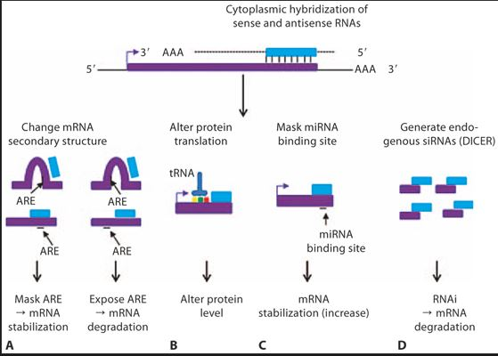
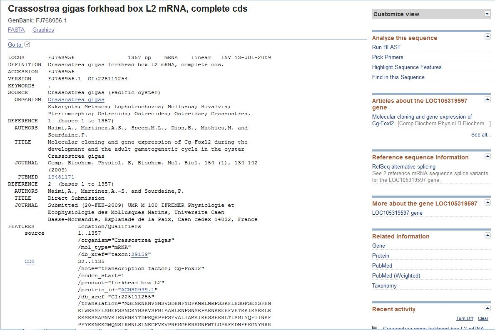
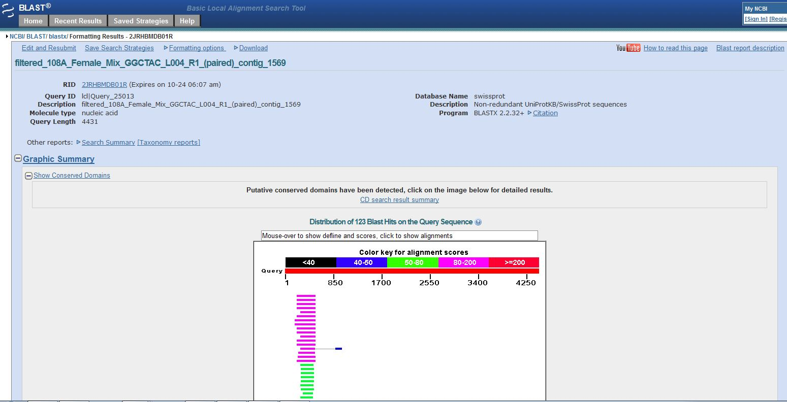
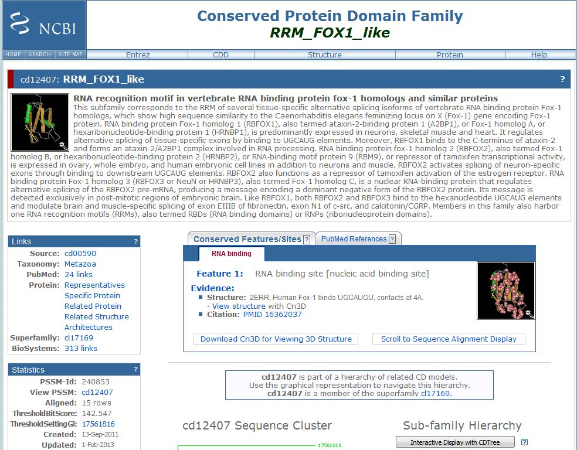

# My Favorite Gene
## FoxL2

This page was created by Clarissa Galindo

**Is it in the Geoduck and olympia transcriptome?**

---

The first thing I did was get a sequence from Genbank in Crassostrea gigas.
This is a direct link to the article:
<http://archimer.ifremer.fr/doc/00012/12291/>

---

In the oyster Crassostrea gigas, a successive hermaphrodite, Cg-Foxl2, an ortholog of Foxl2, is suspected to be involved in vitellogenesis or female sex determination. The existence of a natural antisense transcript (NAT) of this factor has been suspected in gonads but needs to be confirmed to better understand the early events of the gonadic differentiation. The occurrence of this NAT was studied by orientation-specific RT-PCR. The NAT and its mRNA expressions were investigated during the development and in adults by real-time PCR and in situ hybridization. The presence of stable in vivo RNA-RNA duplexes was also explored by RNase protection-based approach. This work is the first evidence of characterization of a NAT in the gonads of mollusks and Lophotrochozoa. This NAT named Cg-Foxl2os is supposed to be polyadenylated and forms RNA-RNA duplexes with its mRNA. Cg-Foxl2os is significantly more expressed than Cg-Foxl2 in 2-month-old spats and in mature males. It is co-localized with the mRNA in the cytoplasm of spermatogonia and spermatocytes. The results of this study demonstrate the existence of a NAT of Cg-Foxl2 in the gonads of C. gigas. It may regulate its mRNA expression through formation of cytoplasmic RNA-RNA duplexes during the oyster gonadic differentiation.




---
This is the gene in Genbank:


This is a direct link to the page
<http://www.ncbi.nlm.nih.gov/nuccore/FJ768956.1>

---

##Blasting against Oylmpia and GeoDuck database

---
my code :)

``` 
!blastn \
-outfmt 6 \
-task blastn \
-evalue 10e-10 \
-query ..\..\big-data\blast\query\Oly_Female.fa \
-db ..\..\big-data\blast\db\fox2Cg \
-out ..\..\big-data\blast\out\Oly_Femalefox2Cg
```

When I run that I found a 6 MATCH!!
Here my code for count:

```
!wc -l ..\..\big-data\blast\out\Oly_Femalefox2Cg
```

Here is the top hit for Olympia Female

```
>filtered_108A_Female_Mix_GGCTAC_L004_R1_(paired)_contig_1569
```

Here is the top hit for Olympia Male

```
>filtered_106A_Male_Mix_TAGCTT_L004_R1_(paired)_contig_5596
```
Here is the top hit for GeoDuck Female

```
>Geo_Pool_F_GGCTAC_L006_R1_001_val_1_(paired)_contig_7400
```

Here is the top hit for GeoDuck Female

```
>Geo_Pool_M_CTTGTA_L006_R1_001_val_1_(paired)_contig_14665
>```
 


When I did a blastx (Olympia female) in Genbank I found:



This is the protein information:


